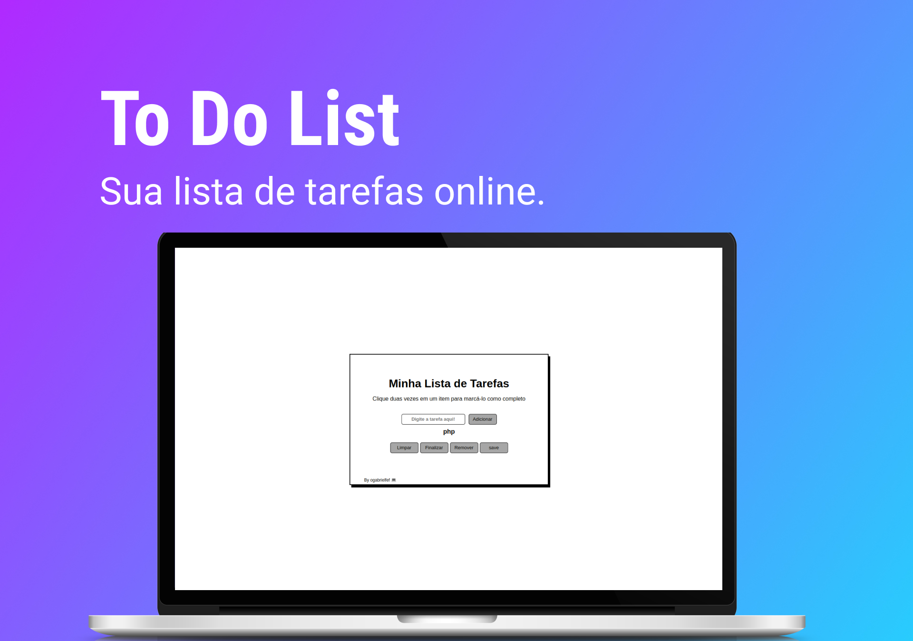

<h1 align="center"> To Do List </h1>

Projeto realizado no módulo de Front End no curso da Trybe 

  <a href="#-tecnologias">Tecnologias</a>&nbsp;&nbsp;&nbsp;|&nbsp;&nbsp;&nbsp;
  <a href="#-projeto">Projeto</a>

 

  

## 🚀 Tecnologias

Esse projeto foi desenvolvido com as seguintes tecnologias:

- HTML e CSS
- JavaScript
- Git e Github

## 💻 Projeto

O To Do List é um programa pra te ajudar no dia a dia. No qual você pode criar uma lista de afazeres, para melhor se organizar.

 

<h2 align="center">Feito com ♥ by ogabrielfef.</h2>